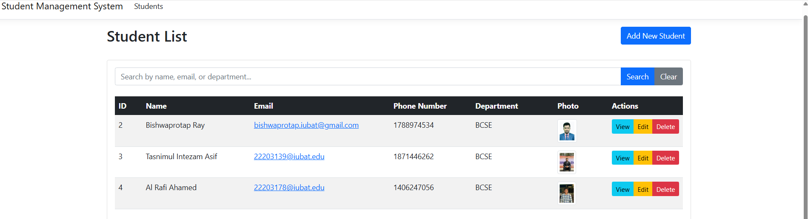
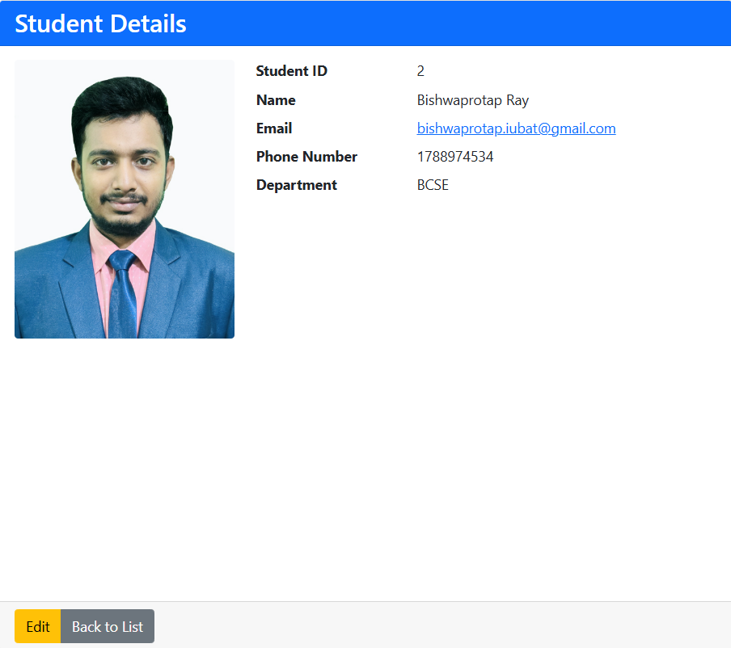
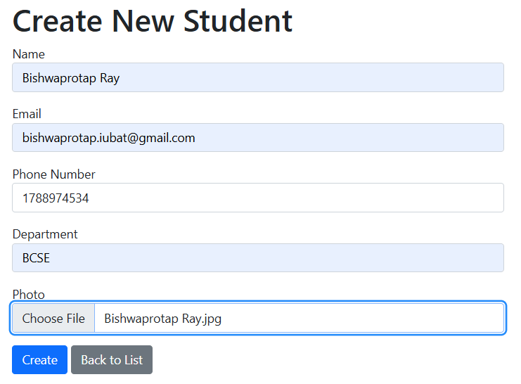
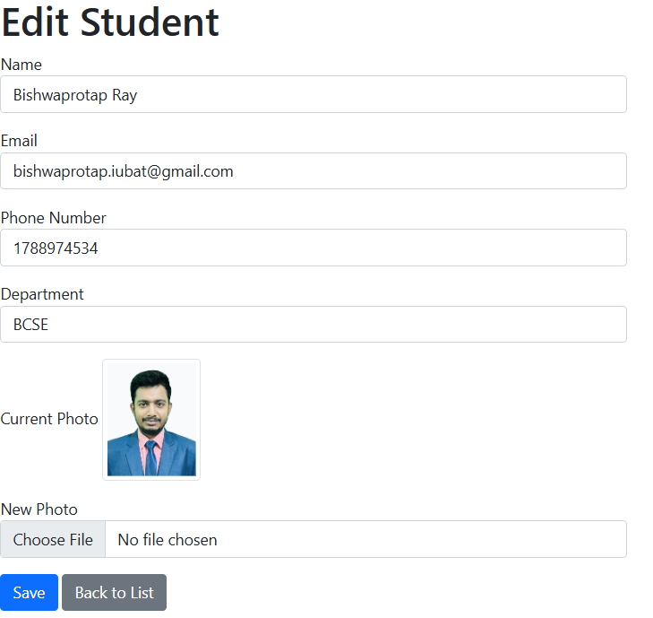
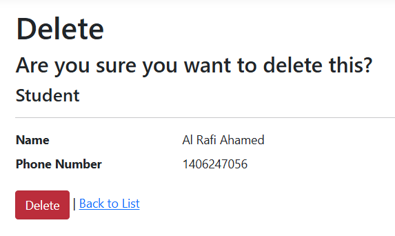

# Student Management System

A modern web application for managing student information, built with ASP.NET Core MVC.

## Screenshots

### Student List View

*Main dashboard showing the list of all students with search, photo, and action buttons.*

### Student Details View

*Detailed view of a student's information, including photo and all fields.*

### Create Student View

*Form for adding a new student, including all required fields and photo upload.*

### Edit Student View

*Form for editing an existing student's information and updating their photo.*

### Delete Confirmation View

*Confirmation page for deleting a student, showing key details before deletion.*

## Features

- **Student Management**
  - Create, Read, Update, and Delete student records
  - View detailed student information
  - Upload and manage student photos
  - Search functionality for quick access to student records

- **Student Information**
  - Student ID
  - Full Name
  - Email Address
  - Phone Number
  - Department
  - Profile Photo

- **User Interface**
  - Responsive design that works on all devices
  - Modern and clean interface
  - Intuitive navigation
  - Real-time search functionality
  - Success notifications
  - Auto-adjusting layouts

## Technologies Used

- **Backend**
  - ASP.NET Core 8.0
  - Entity Framework Core
  - SQL Server

- **Frontend**
  - Bootstrap 5
  - Font Awesome Icons
  - jQuery
  - HTML5/CSS3

## Prerequisites

- .NET 8.0 SDK
- SQL Server
- Visual Studio 2022 or Visual Studio Code

## Installation

1. Clone the repository:
   ```bash
   git clone https://github.com/yourusername/StudentManagementSystem.git
   ```

2. Navigate to the project directory:
   ```bash
   cd StudentManagementSystem
   ```

3. Update the database connection string in `appsettings.json`:
   ```json
   "ConnectionStrings": {
     "DefaultConnection": "Server=(localdb)\\mssqllocaldb;Database=Student_Information;Trusted_Connection=True;MultipleActiveResultSets=true"
   }
   ```

4. Run the following commands to set up the database:
   ```bash
   dotnet ef migrations add InitialCreate
   dotnet ef database update
   ```

5. Run the application:
   ```bash
   dotnet run
   ```

## Project Structure

```
StudentManagementSystem/
├── Controllers/
│   └── StudentsController.cs
├── Models/
│   └── Student.cs
├── Views/
│   └── Students/
│       ├── Index.cshtml
│       ├── Create.cshtml
│       ├── Edit.cshtml
│       ├── Details.cshtml
│       └── Delete.cshtml
├── Context/
│   └── ApplicationDbContext.cs
├── wwwroot/
│   ├── css/
│   ├── js/
│   └── uploads/
└── appsettings.json
```

## Usage

1. **Viewing Students**
   - Access the home page to see the list of all students
   - Use the search bar to find specific students
   - Click on the "View" button to see detailed information

2. **Adding a Student**
   - Click the "Add New Student" button
   - Fill in the required information
   - Upload a photo (optional)
   - Click "Create" to save

3. **Editing a Student**
   - Click the "Edit" button next to the student
   - Modify the information
   - Click "Save" to update

4. **Deleting a Student**
   - Click the "Delete" button next to the student
   - Confirm the deletion

## Features in Detail

### Search Functionality
- Search by name, email, or department
- Real-time filtering
- Clear search option

### Photo Management
- Upload student photos
- Automatic photo resizing
- Default placeholder for missing photos

### Responsive Design
- Adapts to all screen sizes
- Mobile-friendly interface
- Auto-adjusting layouts

## Contributing

1. Fork the repository
2. Create your feature branch (`git checkout -b feature/AmazingFeature`)
3. Commit your changes (`git commit -m 'Add some AmazingFeature'`)
4. Push to the branch (`git push origin feature/AmazingFeature`)
5. Open a Pull Request

## License

This project is licensed under the MIT License - see the LICENSE file for details.

## Acknowledgments

- Bootstrap for the responsive design framework
- Font Awesome for the icons
- ASP.NET Core team for the excellent framework 
